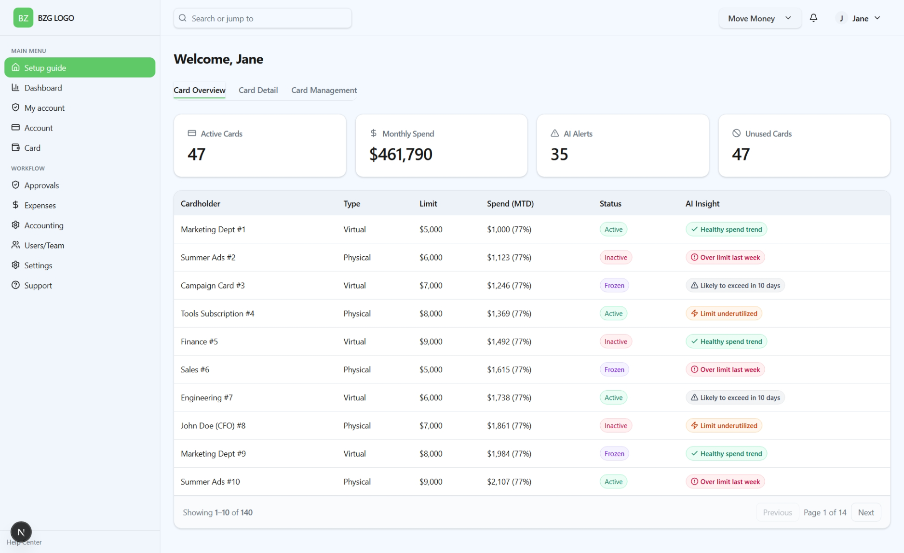

# AI-Fintech Dashboard

A responsive dashboard built with **Next.js**, **TypeScript**, **Tailwind CSS**, and **shadcn/ui**.



---

## 📦 Prerequisites

Make sure you have installed:

- [Node.js](https://nodejs.org/) (LTS v18+ recommended)
- npm (comes with Node)

---

## 🚀 Setup

### 1. Clone the repository
```bash
git clone https://github.com/thiendngo/bzg.git
cd brandzone
```

### 2. Install dependencies
```bash
npm install
```

### 3. Run the development server
```bash
npm run dev
```
Then open [http://localhost:3000](http://localhost:3000) in your browser.

### 4. Build for production
```bash
npm run build
npm start
```

---

## ⚙️ Project Structure

```
src/
 ├─ app/
 │   ├─ layout.tsx          # Root layout
 │   ├─ page.tsx            # Dashboard entry point
 │   └─ globals.css         # Global styles & theme variables
 ├─ components/
 │   ├─ dashboard/          # Sidebar, Topbar, KPIs, CardsTable, etc.
 │   └─ ui/                 # shadcn/ui components
 ├─ data/
 │   └─ cards.ts            # Mock card data (140+ rows)
 └─ lib/
     └─ format.ts           # Helpers for formatting money/currency
```

---

## 🛠 Common Issues

- **Tailwind styles not applied**  
  Ensure `globals.css` is imported in `app/layout.tsx`.

- **CLI issues with `tailwindcss`**  
  Reinstall Tailwind:
  ```bash
  npm install -D tailwindcss postcss autoprefixer
  ```

---

## 📜 License

MIT
